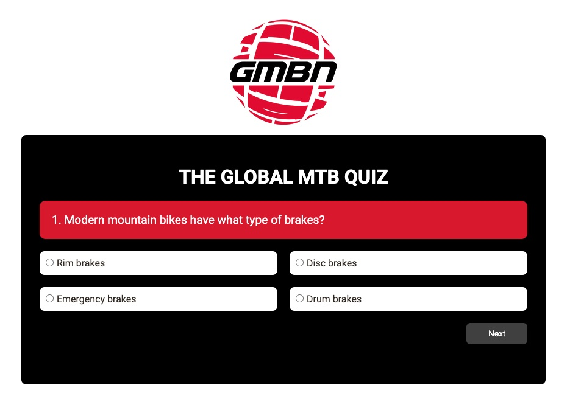

# MTB Quiz App

A mountain bike multiple choice JavaScript quiz application.

## Table of contents

- [Overview](#overview)
  - [The purpose](#the-purpose)
  - [Screenshot](#screenshot)
  - [Links](#links)
- [My process](#my-process)
  - [Built with](#built-with)
  - [What I learnt](#what-i-learnt)
  - [Useful resources](#useful-resources)
- [Status](#status)
- [Author](#author)

## Overview

### The purpose

The purpose of this project was to learn how to develop a simple quiz application using HTML, CSS and JS. I have a deep passion for mountain biking and thought it would be fun to create a quick quiz for other fellow mountain bikers and subscribers of the channel GMBN.

Users should be able to:

Select from 10 multiple choice questions and proceed onto the next question. At the very end they will be presented with their score out of 100.

### Screenshot



Above is what you should see when you click on the link below.

### Links

- Solution URL: [Solution](https://github.com/Max88-git/mtb-quiz)
- Live Site URL: [Live Site](https://max88-git.github.io/mtb-quiz/)

## My process

### Built with

- HTML5 markup
- CSS custom properties
- CSS Grid
- Vanilla JavaScript

### What I learnt

* How to use the onclick event attribute to load a new question.
* How to create an array of obects for the questions in JavaScript.
* I learnt how to manipulate the DOM by using the method document.getElementById.
* Use if statements to specify a block of code to be executed, if a specified condition is true.
* Make a CSS grid container for question options.

Here are some code snippets I am proud of:

```js
   //Hide the container to reveal the score after final question
    if(currentQuestion == totalQuestions){
        container.style.display = "none";
        resultCont.style.display = "";
        resultCont.textContent = `Your Score: ${score}/100`;
        return;
    }
```

### Useful resources

- [MDN - getElementById()](https://developer.mozilla.org/en-US/docs/Web/API/Document/getElementById) - This helped me understand how getElementById() is used when you want to manipulate, or get info from, an element on your document.
- [freeCodeCamp - Array of Objects](https://www.freecodecamp.org/news/javascript-array-of-objects-tutorial-how-to-create-update-and-loop-through-objects-using-js-array-methods/) - This was useful in understanding how to create an array of objects. I learnt that they are used to store multiple values in a single variable.

## Status
Project is: in progress

## Author

- Website - [Max Lockwood](https://www.maxlockwood.uk/)


